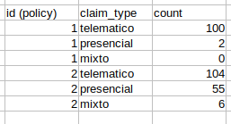

## SQL

Supongamos que tenemos el siguiente esquema de Base de Datos

* Policies
* status podrá ser activa o inactiva
* Claims
* claim_type podrá ser telemático, presencial o mixto
* Users

Escribe en SQL para extraer la siguente información

**1)** Número de pólizas activas

 

**2)** Listado de todas las campañías activas. Una compañia está activa si al menos hay una poliza activa (company_id)

 

**3)** Número de compañías activas

 

**4)** Numero de siniestros por cada poliza desglosado por tipo de siniestro

